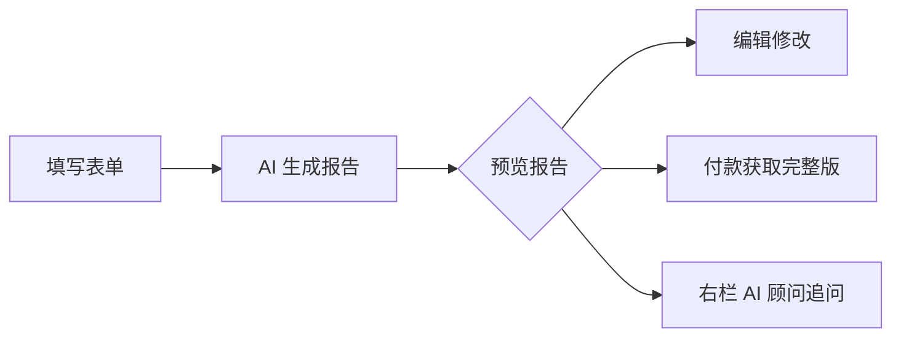

# 合伙算钱 — AI 合伙分钱方案生成器 V0.4

> **合伙关系诊断 + 分钱方案 + 五权结构 + 协议条款包**

**线上体验**：https://ai-partner-fenqian.onrender.com  
**技术栈**：React + CopilotKit + Express + SQLite + DeepSeek

---

## 这是什么？

**"合伙算钱"** 是一款 AI 驱动的合伙分钱方案生成工具。不是简单问答——而是根据你的合伙信息（出资、出力、利润、管控模式），生成**结构化诊断报告**。

### 一份报告包含 10 个模块：
1. 合伙关系摘要
2. 核心矛盾诊断
3. 推荐分配方案（含三种方案对比）
4. 利润模拟表
5. 贡献估值表（6维度：资金/时间/经营/资源/风险/可替代性）
6. 五权结构诊断（所有权/分红权/经营权/决策权/退出权）
7. 潜在风险预警（红黄绿线）
8. 谈判建议
9. 条款模板参考
10. 协议文件清单

### 一次完整的体验流：


---

## 核心功能

### 🤖 AI 一键填表
点绿色按钮，用一句话描述情况，AI 自动填好左侧全部表单。

### 📝 报告编辑
生成报告后，可直接选择模块输入修改指令，局部调整或全部重做。

### 💬 CopilotKit AI 顾问
右侧侧边栏 AI 顾问理解你的表单数据，回答关于五权结构、贡献估值、案例对比等问题。

### 🔐 付费档位
- **29.9 元**：完整 AI 报告（含五权诊断）+ 三套方案 + 基础条款草稿
- **99 元**：含人工审核一次 + 可补充信息重生成 + 重点条款草稿 + 协议清单

---

## 技术架构

| 层级 | 技术 | 说明 |
|------|------|------|
| 前端 | React 19 + Vite | CopilotKit Sidebar + 内联样式工作台 |
| Agent | CopilotKit Runtime v2 | BuiltInAgent + DeepSeek + defineTool |
| AI | DeepSeek Chat API | 10 模块结构化 Prompt |
| 后端 | Express 4 | REST API + SQLite + CORS |
| 部署 | Render (Free) | Serverless Node + 自动部署 |
| 知识库 | SQLite 内嵌 | 7 案例 + 20 规则 + 26 模板 |

---

## V0.4 完整升级

| 维度 | V0.3 | V0.4 |
|------|------|------|
| 报告模块 | 8 模块 | **10 模块**（新增贡献估值表+五权结构诊断） |
| 合伙人数 | 2-3 人 | **2-4 人** |
| 表单 | 基础信息 | **基础+进阶诊断10个字段** |
| 知识库 | 6+12+11 | **7+20+26**（阿德沃协议脱敏入库） |
| 付费档位 | 29/99 元 | **29.9/99 元**（权益差异明确） |
| AI 顾问 | 基础问答 | **解释五权/代持/表决权/档位差异** |
| 报告修改 | ❌ | **✅ 局部/全部编辑 + 历史记录** |
| AI 填表 | ❌ | **✅ 自然语言描述一键填表** |
| UI 设计 | 紫蓝渐变 | **slate+emerald 北欧风** |
| 模块校验 | 4 模块 | **10 模块全量校验** |

---

## 部署指南

```bash
# 0. 环境变量
cp .env.example .env
# 填入 DEEPSEEK_API_KEY / ADMIN_TOKEN

# 1. 安装
npm install

# 2. 构建 + 启动
./start.sh

# 3. 访问
# http://localhost:3000
```

### Render 部署注意
- 免费版 15 分钟无请求会休眠，下次冷启动约 30 秒
- SQLite 数据非持久化（重启丢失，seed.js 自动注入）
- env var 有 **30 字符截断限制**，API Key 超长需拆 P1/P2 拼接

---

## 知识库数据

| 表 | 数量 | 来源 |
|----|------|------|
| knowledge_cases | 7 | 真实案例脱敏 + 阿德沃协议脱敏 |
| rules | 20 | 股权基础知识 + 阿德沃规则 |
| templates | 26 | 基础模板 + 15 条阿德沃协议条款模板 |

## Admin 后台

需 `ADMIN_TOKEN` 验证：
- `GET /api/admin/knowledge-cases?token=xxx` — 查看案例库
- `GET /api/admin/rules?token=xxx` — 查看规则库
- `GET /api/admin/templates?token=xxx` — 查看模板库
- `POST /api/admin/cases/:id/promote` — 提升案例到知识库
- `GET /api/cases?token=xxx` — 查看用户提交的案例
- `PUT /api/cases/:id/review` — 审核状态更新

---

## 本地开发

```bash
npm run dev:frontend   # Vite HMR 开发服务器 (端口 5173)
npm run dev:backend    # Node 后端 (端口 3000)
```

或代理模式：
```bash
# Vite 配置 proxy: /api → localhost:3000
npm run dev  # 同时运行前端+后端
```

---

## 项目结构

```
├── server/          # Express 后端
│   ├── index.js     # 主入口（所有 API 路由）
│   ├── db.js        # SQLite 数据库
│   ├── ai.js        # DeepSeek AI 调用
│   ├── prompt.js    # 10 模块 Prompt 模板
│   ├── copilotkit.js # CopilotKit Agent 运行时
│   ├── matcher.js   # 案例/规则匹配算法
│   └── report.js    # 利润模拟表计算
├── src/             # React 前端
│   ├── App.jsx      # CopilotKit Provider + Sidebar
│   ├── ChatApp.jsx  # 主工作台（表单+报告+编辑+付款）
│   └── main.jsx     # 入口
├── scripts/         # 工具脚本
│   └── seed_adewo_agreement.js  # 阿德沃协议脱敏种子
├── dist/            # Vite 构建输出
├── public/          # 旧版前端（V0.1/0.2）
├── start.sh         # 部署启动脚本
└── package.json
```

---

## License

MIT
